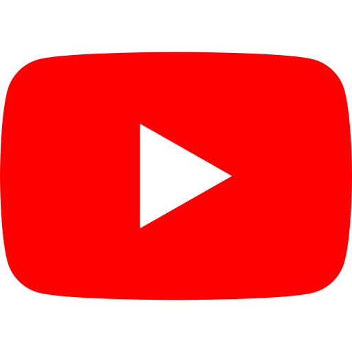
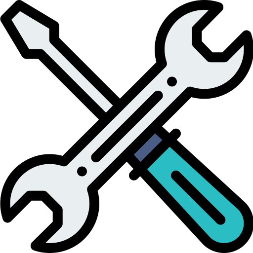
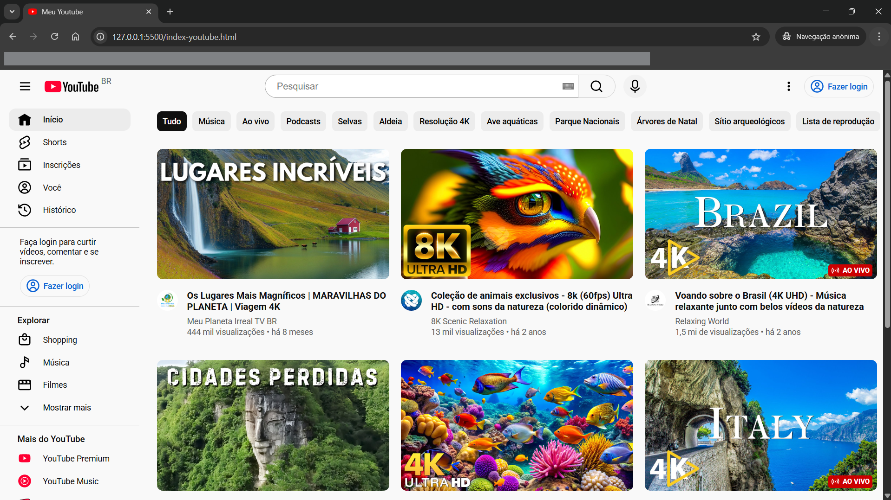

#  YouTube Diferenciado

> Réplica moderna da interface do YouTube construída do zero com HTML5 semântico, CSS3 avançado e JavaScript vanilla.
>
> Um projeto que demonstra domínio de estrutura semântica, acessibilidade web (WCAG 2.1) e técnicas de frontend moderno, ideal para portifólio de desenvolvimento web.


##  Aprendizados

- HTML5 semântico e acessível
- CSS Flexbox e técnicas avançadas
- JavaScript para interatividade
- Boas práticas de código
- Estrutura de projeto profissional

---

##  Estrutura do Projeto

```
youtube-diferenciado/
├── assets/
├── index-youtube.html
├── script-youtube.js
├── style-youtube.css
└── Readme.md
```

---

##  Tecnologias Utilizadas

<!-- 
center
-->

- **HTML5** - Estrutura semântica
- **CSS3** - Estilização e layout
- **Google Fonts** - Fonte Roboto

<br>

<p align="center">
  <a href="file:///C:/Users/Igorc/OneDrive/Documentos/IGOR%20C%C3%89SAR%20-%20PESSOAL/Igorph10/Youtube/index-youtube.html">
    
  </a>
  <a href="file:///C:/Users/Igorc/OneDrive/Documentos/IGOR%20C%C3%89SAR%20-%20PESSOAL/Igorph10/Youtube/style-youtube.css">
    
  </a>
  <a href="file:///C:/Users/Igorc/OneDrive/Documentos/IGOR%20C%C3%89SAR%20-%20PESSOAL/Igorph10/Youtube/script-youtube.js">
    
  </a>
</p>

<br>

##  Funcionalidades

```
◾ Interface fiel ao Youtube, utilizando como base HTML e CSS3
◾ HTMl semântico e bem estruturado - tags e estrutura semânticas, classes e id bem definidas
    ◾ Head com metadados e informações bem definidadas
    ◾ Cabeçalho (header) estruturado com a logo do Youtube, a Caixa de Pesquisa e a Caixa de Login
    ◾ Conteúdo Principal (main) estruturado em seções - Menu Lateral, Categorias e os Vídeos
 Estilização do CSS3 fiel ao Youtube
    ◾ Estruturado e organizado seguindo a ordem da estrutura do HTML
    ◾ Classes bem intuitivas e alguns comentários de orientação
◾ Grids responsivos e bem estruturados de cada vídeo
◾ Estilização de uma Badge "AO VIVO" em transmissões em certo vídeos
```

---

##  Destaques Técnicos

### HTML5 Semântico
- Estrutura com tags semânticas: `<header>`, `<main>`, `<nav>`, `<aside>`, `<section>`, `<article>`
- Listas (`<ul>` + `<li>`) com `role="list"` para compatibilidade com VoiceOver/Safari

### CSS3 Avançado
- **Flexbox**: Layouts responsivos em header, sidebar e grid de vídeos
- **Componentes fundidos**: Input + botão com `border-radius` opostos criando elemento único
- **Posicionamento absoluto**: Ícones internos (teclado virtual) e badges ("AO VIVO") com `position: absolute`

### JavaScript Vanilla
- Manipulação DOM: `querySelector`, `querySelectorAll`, `getElementById`
- Toggle dinâmico de visibilidade com atualização de `aria-expanded`
- Event handling para menu "Mostrar mais/menos"

---

##  Principais Técnicas

### 1. Input + Botão Fundidos
Técnica de fusão visual criando um único componente a partir de dois elementos separados.

```css
.input-pesquisa {
    border-radius: 40px 0 0 40px;
    border-right: none;
}

.btn-pesquisa {
    border-radius: 0 40px 40px 0;
    border-left: none;
}
```

### 2. Posicionamento Absoluto com Container Relativo
Badge "AO VIVO" posicionada sobre a thumbnail do vídeo usando contexto de posicionamento.

```css
.thumb-wrapper {
    position: relative;
}

.retangulo-aovivo {
    position: absolute;
    bottom: 8px;
    right: 8px;
}
```

### 3. Animação de Rotação com Transform
Rotação suave da seta do botão "Mostrar mais/menos" usando CSS transitions.

```css
.btn-mostrar-mais .icone-seta {
    transition: transform 0.2s ease;
}

.btn-mostrar-mais.expandido .icone-seta {
    transform: rotate(180deg);
}
```

---

##  Preview do Projeto



---

##  Desenvolvedor Igor César

**Informações para Contato:**
- GitHub: [@Igorph10](https://github.com/Igorph10)

- LinkedIn: [Igor César Pinheiro da Silva](https://www.linkedin.com/in/igor-césar-pinheiro-da-silva-9a58192b9)
